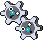
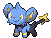
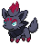
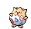
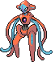
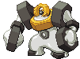
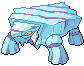
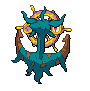
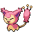
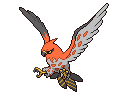

<!-- https://play.pokemonshowdown.com/sprites/gen5ani/
https://www.deviantart.com/mbcmechachu/favourites/70416144/pokemon-animated-sprites-gen-5-style
-->

  
   
  
  
  
  
  
  
  
  
  
  
  
  
  
  
  
  
  

![Matplotlib](https://img.shields.io/badge/Matplotlib-%23285479.svg?logo=data:image/svg+xml;base64,PD94bWwgdmVyc2lvbj0iMS4wIiBlbmNvZGluZz0idXRmLTgiPz4KPHN2ZyB2aWV3Qm94PSIwIDAgNTAwIDUwMCIgeG1sbnM9Imh0dHA6Ly93d3cudzMub3JnLzIwMDAvc3ZnIj4KICA8ZGVmcy8+CiAgPHBhdGggZD0iTSAyNDUuMzExIDYuMjc4IEMgNTguMjggOS4yNTIgLTU1LjQwMSAyMTMuNzk3IDQwLjY4NCAzNzQuNDYzIEMgMTM2Ljc3NCA1MzUuMTMgMzcwLjU2MyA1MzEuNDE1IDQ2MS41MDcgMzY3Ljc3NiBDIDU1MC43OTMgMjA3LjEyNCA0MzYuNjQ0IDkuMTk3IDI1My4wMjQgNi4yNzggTCAyNDUuMzExIDYuMjc4IFogTSAyNDUuMzExIDYwLjMzNiBDIDk5Ljg1NSA2My4zMDggMTIuMTU4IDIyMi44MDIgODcuNDU5IDM0Ny40MjMgQyAxNjIuNzU5IDQ3Mi4wNDUgMzQ0LjU3OCA0NjguMzI3IDQxNC43MzcgMzQwLjczNSBDIDQ2My4zNTQgMjUyLjMxMiA0MzMuMDczIDE0OS42NSAzNjAuNjI3IDk2LjQ0MiBDIDMzMC45ODIgNzQuNjY4IDI5NC4yNzUgNjEuMTc4IDI1My4wMjQgNjAuMzM2IEwgMjQ1LjMxMSA2MC4zMzYgWiBNIDI0NS4zMTEgMTE0LjM5MyBDIDE0MS40MzMgMTE3LjM2NiA3OS43MjYgMjMxLjc5OCAxMzQuMjM2IDMyMC4zNjggQyAxODguNzQ0IDQwOC45NDEgMzE4LjU4OSA0MDUuMjI2IDM2Ny45NTkgMzEzLjY4IEMgNDE1LjcwOCAyMjUuMTMzIDM1My41MDMgMTE3LjI2NSAyNTMuMDI0IDExNC4zOTMgTCAyNDUuMzExIDExNC4zOTMgWiBNIDI0NS4zMTEgMTY4LjQ1MSBDIDE4My4wMzEgMTcxLjQyNCAxNDcuMzE5IDI0MC43NzYgMTgxLjAzIDI5My4yODUgQyAyMTQuNzQzIDM0NS43OTQgMjkyLjU5MyAzNDIuMDc5IDMyMS4xNjIgMjg2LjU5NiBDIDM0OC4xOCAyMzQuMTI2IDMxMS45MjQgMTcxLjI2MSAyNTMuMDI0IDE2OC40NTEgTCAyNDUuMzExIDE2OC40NTEgWiBNIDI0NS4zMTEgMjIyLjUwOCBDIDIyNC43NDEgMjI1LjQ4MSAyMTUuMDk4IDI0OS42MjkgMjI3Ljk1NCAyNjUuOTc4IEMgMjQwLjgwOSAyODIuMzI2IDI2Ni41MjQgMjc4LjYxMiAyNzQuMjM3IDI1OS4yOSBDIDI4MC43MjUgMjQzLjA0NSAyNzAuMzE5IDIyNS4wMDYgMjUzLjAyNCAyMjIuNTA4IEwgMjQ1LjMxMSAyMjIuNTA4IFogTSA0OTIuMTU5IDI0OS41MzcgTCA2LjE3NiAyNDkuNTM3IE0gNDIyLjczMiA3NS43OCBMIDc1LjYwMyA0MjMuMjkzIE0gNDIyLjczMiA0MjMuMjkzIEwgNzUuNjAzIDc1Ljc4IE0gMjQ5LjE2NyA2LjI3OCBMIDI0OS4xNjcgNDkyLjc5NSIgc3R5bGU9InBhaW50LW9yZGVyOiBzdHJva2UgbWFya2VyczsgZmlsbC1ydWxlOiBldmVub2RkOyBmaWxsOiByZ2IoMjU1LCAyNTUsIDI1NSk7IGZpbGwtb3BhY2l0eTogMDsgc3Ryb2tlLXdpZHRoOiAxMHB4OyBzdHJva2U6IHJnYigyNTUsIDI1NSwgMjU1KTsiLz4KICA8cGF0aCBkPSJNIDE5NS4xNjkgMzMuMzA3IEwgMTE4LjAzIDcxLjkyIEwgMzgwLjMwNSA0MjcuMTU0IEwgNDE4Ljg3NSAzODguNTQyIEwgMjQ5LjE2NyAyNDkuNTM3IEwgMTk1LjE2OSAzMy4zMDcgWiIgc3R5bGU9ImZpbGw6IHJnYigyNTUsIDI1NSwgMjU1KTsiLz4KICA8cGF0aCBkPSJNIDY3Ljg4OCAxOTUuNDggTCA2Ny44ODggMzAzLjU5NCBMIDI0OS4xNjcgMjQ5LjUzNyBMIDY3Ljg4OCAxOTUuNDggWiIgc3R5bGU9ImZpbGw6IHJnYigyNTUsIDI1NSwgMjU1KTsiLz4KICA8cGF0aCBkPSJNIDI0OS4xNjcgMjQ5LjUzNyBMIDI3Mi4zMDkgMzg0LjY4IEwgMjI2LjAyNSAzODQuNjggTCAyNDkuMTY3IDI0OS41MzcgWiIgc3R5bGU9ImZpbGw6IHJnYigyNTUsIDI1NSwgMjU1KTsiLz4KICA8cGF0aCBkPSJNIDI0OS4xNjcgMjQ5LjUzNyBMIDI5OS4zMDkgOTUuMDg2IEwgMzM0LjAyMSAxMTQuMzkzIEwgMjQ5LjE2NyAyNDkuNTM3IFoiIHN0eWxlPSJmaWxsOiByZ2IoMjU1LCAyNTUsIDI1NSk7Ii8+CiAgPHBhdGggZD0iTSAyNDkuMTY3IDI0OS41MzcgTCAzMDMuMTY1IDIyNi4zNjkgTCAzMDcuMDIyIDI0MS44MTQgTCAyNDkuMTY3IDI0OS41MzcgWiBNIDI0OS4xNjcgMjQ5LjUzNyBMIDE0OC44ODUgMjk5LjczMyBMIDE2MC40NTcgMzE1LjE3OCBMIDI0OS4xNjcgMjQ5LjUzNyBaIiBzdHlsZT0iZmlsbDogcmdiKDI1NSwgMjU1LCAyNTUpOyIvPgo8L3N2Zz4=&logoColor=white)
![Seaborn](https://img.shields.io/badge/Seaborn-%2388afbb.svg?logo=data:image/svg+xml;base64,PHN2ZyB4bWxucz0iaHR0cDovL3d3dy53My5vcmcvMjAwMC9zdmciIHZpZXdCb3g9IjAgMCA1MDAgNTAwIj48cGF0aCBkPSJNNiAyMDhjNy00NCAyNi04MiA1NC0xMTZBMjQyIDI0MiAwIDAgMSAyNzggNWEyMzkgMjM5IDAgMCAxIDE2MSA4NSAyNDggMjQ4IDAgMCAxIDU5IDE0OCAyNDYgMjQ2IDAgMCAxLTU2IDE2OGMtMjMgMjctNTEgNDgtODMgNjRBMjUxIDI1MSAwIDAgMSAyNyAzNTcgMjQ0IDI0NCAwIDAgMSA2IDIwOG0xNyAxMDNhMjM2IDIzNiAwIDAgMCAzNzcgMTE4Yzc3LTYxIDEwNi0xNjggNzAtMjU5QTIyNyAyMjcgMCAwIDAgMjc2IDE4IDIzMiAyMzIgMCAwIDAgMjMgMzEwWiIgZmlsbD0iI2ZmZiIgb3BhY2l0eT0iMSIvPjxwYXRoIGQ9Ik0yMyAzMTBBMjMzIDIzMyAwIDAgMSAyNzYgMThjOTUgMTIgMTYwIDYzIDE5NCAxNTEgMzYgOTEgNyAxOTgtNzAgMjYwQTIzNiAyMzYgMCAwIDEgMjMgMzEwbTQwNi0xODloMWwtMS0yLTEwLTEzYy02MC02NS0xMzUtOTAtMjIzLTcwQzEzNSA1MCA5MCA4NyA1NyAxNDBjLTcgMTItMTIgMjUtMTcgMzhsMiAyIDM1LTRjMjYtNiA1My05IDc3LTE5IDM1LTEzIDY5LTMwIDEwMy00NiA0NC0yMSA4OS0yNiAxMzYtNmwzNiAxNk0zNiAyODBsLTUgNCAxMCA0MiA1Mi0yM2MzNi0xNSA3My0xNiAxMDktMiAyMCA4IDM5IDE2IDU3IDI2IDUyIDI3IDEwNiA0NyAxNjUgNTEgNSAwIDgtMSAxMS01IDE4LTI4IDMwLTU4IDM1LTkwLTE3LTYtMzQtMTAtNTAtMTctMzEtMTMtNjEtMjgtOTItNDMtNTEtMjUtMTAzLTI2LTE1NCAwbC00MiAyMWMtMzEgMTUtNjIgMjktOTYgMzZtMTQyIDI2Yy00OS0xMC05MSA4LTEzMyAzMCAzOSA3OSAxMDAgMTI2IDE4OCAxMzMgNzYgNiAxMzgtMjIgMTg4LTc4LTI1LTUtNDktOS03My0xNi0zNy05LTcwLTI4LTEwNC00NGwtNjYtMjVtLTM0LTgwIDM1LTE3YzQ0LTIxIDg5LTI0IDEzNS0zbDUzIDI1YzI5IDE0IDU4IDI3IDg5IDM1bDE2IDRjMy00MS00LTc5LTIxLTExNS01LTEwLTExLTE4LTIyLTIybC0zMC0xNGMtNDAtMTctODAtMjEtMTIxLTRsLTY2IDMwYy01MyAyOC0xMTAgNDQtMTcwIDQ3LTUgMC03IDItOCA3bC02IDM3djM0YzQyLTggNzktMjYgMTE2LTQ0WiIgZmlsbD0idHJhbnNwYXJlbnQiIG9wYWNpdHk9IjEiLz48cGF0aCBkPSJNMzYgMjgwYzM0LTcgNjUtMjEgOTYtMzZsNDItMjFjNTEtMjYgMTAzLTI1IDE1NCAwIDMxIDE1IDYxIDMwIDkyIDQzIDE2IDcgMzMgMTEgNTAgMTctNSAzMi0xNyA2Mi0zNSA5MC0zIDQtNiA1LTExIDUtNTktNC0xMTMtMjQtMTY1LTUxLTE4LTEwLTM3LTE4LTU3LTI2LTM2LTE0LTczLTEzLTEwOSAybC01MiAyMy0xMC00MiA1LTRaIiBmaWxsPSIjZmZmIiBvcGFjaXR5PSIxIi8+PHBhdGggZD0ibTE3OSAzMDYgNjUgMjVjMzQgMTYgNjcgMzUgMTA0IDQ0IDI0IDcgNDggMTEgNzMgMTYtNTAgNTYtMTEyIDg0LTE4OCA3OC04OC03LTE0OS01NC0xODgtMTMzIDQyLTIyIDg0LTQwIDEzNC0zMFptLTM2LTgwYy0zNiAxOC03MyAzNi0xMTUgNDR2LTM0bDYtMzdjMS01IDMtNyA4LTcgNjAtMyAxMTctMTkgMTcwLTQ3bDY2LTMwYzQxLTE3IDgxLTEzIDEyMSA0bDMwIDE0YzExIDQgMTcgMTIgMjIgMjIgMTcgMzYgMjQgNzQgMjEgMTE1bC0xNi00Yy0zMS04LTYwLTIxLTg5LTM1bC01My0yNWMtNDYtMjEtOTEtMTgtMTM1IDNsLTM2IDE3WiIgZmlsbD0iI2ZmZiIgb3BhY2l0eT0iMSIvPjxwYXRoIGQ9Im00MjkgMTIwLTM2LTE1Yy00Ny0yMC05Mi0xNS0xMzYgNi0zNCAxNi02OCAzMy0xMDMgNDYtMjQgMTAtNTEgMTMtNzcgMTlsLTM1IDQtMi0yYzUtMTMgMTAtMjYgMTctMzggMzMtNTMgNzgtOTAgMTM5LTEwNCA4OC0yMCAxNjMgNSAyMjMgNzBsMTAgMTRaIiBmaWxsPSIjZmZmIiBvcGFjaXR5PSIxIi8+PHBhdGggZD0ibTQyOSAxMjAgMSAxaC0xdi0xWiIgZmlsbD0iI0IzRDZERSIgb3BhY2l0eT0iMSIvPjwvc3ZnPg==&logoColor=white)

-green)

This is a **complete Data Science project**, with 3 main objectives:

1. **Generation of a dataset using web scraping** containing information about all Pokémon (up to Generation IX), including variants and forms.
2. **Preprocessing** of the dataset, extraction of basic information, and informative **visualizations**.
3. Apply **Machine Learning and AI techniques** to calculate higher-level information and visualizations.

<h1>$${\color{royalblue}\textbf{Part 1: Dataset creation, web scraping}}$$  </h1>

To generate the Pokémon dataset, a web scraper has been programmed using Python to gather all the required information from [Bulbapedia](https://bulbapedia.bulbagarden.net/wiki/Main_Page).  

Information is extracted for every Pokémon and variation listed in the [List of Pokémon by National Pokédex Number](https://bulbapedia.bulbagarden.net/wiki/List_of_Pok%C3%A9mon_by_National_Pok%C3%A9dex_number). This includes regional variations and alternate forms but excludes Mega Evolutions and Dynamax forms.  

The extracted information is stored in a `.csv` file, where each row corresponds to a Pokémon and its form. The following information is extracted:
- **DexNumber**: Number of the National Pokédex for that Pokémon.
- **Name**: Name of the Pokémon.
- **Type**: Pokémon's typing as a list.
- **Abilities**: Pokémon's abilities as a list.
- **HiddenAbility**: Pokémon's Hidden Ability
- **Generation**: The generation where it was introduced.
- **Hp**: Hp base stat.
- **Attack**: Attack base stat.
- **Defense**: Defense base stat.
- **SpecialAttack**: Special attack base stat.
- **SpecialDefense**: Special defense base stat.
- **Speed**: Speed base stat.
- **TotalStats**: Total stats (sum of the previous six stats).
- **Weight**: Weight in kg.
- **Height**: Height in m.
- **GenderProbM**: Probability of a Pokémon of that species being male (if it has unknown gender, it will be None).
- **Category**: Category of that Pokémon (some distinct Pokémons have the same categories, and it may vary between evolutions).
- **CatchRate**: Capture rate of that Pokémon.
- **EggCycles**: Number of cycles (steps, the number of steps in each cycle varies among games) to hatch an egg of that Pokémon.
- **EggGroup**: Egg Group(s) of that Pokémon.
- **LevelingRate**: Class of the XP growth of that Pokémon.
- **BaseFriendship**: Base friendship of that Pokémon.
- **IsLegendary**: Denotes if it is a legendary Pokémon.
- **IsLegendary**: Denotes if it is a legendary Pokémon.
- **IsMythical**: Denotes if it is a mythical Pokémon.
- **IsUltraBeast**: Denotes if it is an ultra beast.
- **HasMega**: Has a Mega evolution.
- **EvoStage**: Evolution Stage of that Pokémon.
- **TotalEvoStages**: Total evolution stages for that Pokémon.
- **PreevoName**: Name of the Preevolution (in case that Pokémon has one)
- **DamageFrom(Type)**: Amount of damage taken for a specific attack type.

Information about Pokémon moves is not currently extracted but is planned for a future iteration of the project.  

<h1>$${\color{gold}\textbf{Part 2: Preprocessing, analysis, visualizations}}$$  </h1>

In this second part of the project, additional **cleaning and visualization** techniques are applied to gain a deeper understanding of the dataset extracted from the internet.  

Two Jupyter notebooks are used in this phase: `preprocess.ipynb` and `visualizationsEDA.ipynb`.  

<h2>$${\color{gold}\textbf{Data Cleaning}}$$</h2>

In `preprocess.ipynb`, data preprocessing and initial **single feature statistics** are performed. In addition, some **attributes** were divided into several ones to store **atomic information** (Type divided into Type1 and Type2, Abilities divided into Ability1, Ability2, and HiddenAbility, EggGroup divided into EggGroup1 and EggGroup2, or the creation of an additional feature named NoGender, which indicates whether the Pokémon has a Gender or not, complementing the GenderProb feature).

**Two preprocessed datasets** were created: one prepared for **visualizations** (the next section in this part) and another for applying **machine learning techniques**, which will be used in part 3.

<h2>$${\color{gold}\textbf{Data Visualizations}}$$</h2>

In `visualizationsEDA.ipynb`, which contains advanced visualizations, we can extract some impactful conclusions. Here, I will present some of the most interesting plots, although there are more within the code itself. I will divide them into subsections:

<h3>$${\color{orange}\textbf{Types}}$$</h3>

The information about types is very interesting and allows us to create many visualizations that provide curious insights.

    

In this chord diagram, we can see the "**relationships between types**," where a relationship between types is understood when **a Pokémon shares two types**. Therefore, some types will be more closely related (e.g., Normal and Flying), while others will be less related (e.g., Electric and Fairy), or even not related at all (e.g., Bug and Dragon).

      
       

In these graphs, we can see, on one hand, the **number of Pokémon of each type that have appeared in each generation and their type distribution** (in Generation 6, there is a significant spike in Fairy-type Pokémon, not because the type was introduced in this generation, but because it accounts for all forms of Flabébé, Floette, and Florges). Each Pokémon counts as 1, so if a Pokémon has two types, it adds 0.5 to each type in the graph. We can also see here which generation introduced the most Pokémon and which one introduced the fewest (5th and 6th, respectively). The second graph is very informative about **which type is the best offensively**, not only considering the type chart, but also calculating the damage multiplier to each Pokémon in particular, using kernel density estimation, as well as an average damage multiplier. It shows that the best offensive type on average is Rock with an average multiplier of x1.22, and the least effective is Normal with a multiplier of x0.86 (Normal, because it is not super effective against any type but has resistances and immunities).

     
     

In the last graph, we can see two relevant aspects. The first answers the question **"Are some types 'stronger' than others?"**, and the answer is **yes, on average**. In general, Steel-type Pokémon have higher average stats than Ice-type Pokémon. **The strongest type in terms of average stats is Dragon, and the weakest is Bug**, which makes sense because there are many legendary and pseudo-legendary Dragon-type Pokémon, while there are many weak Bug-type Pokémon from early routes. Additionally, the average stats for each individual stat (HP, Attack, Defense, Special Attack, Special Defense, Speed) are shown in more detail, which leads us to the next visualization point:

<h3>$${\color{orange}\textbf{Pokémon Stats}}$$</h3>

For this, an analysis has been conducted. First, a **complete bivariate distribution analysis of offensive statistics** (Attack and Speed), (Special Attack and Speed), and defensive statistics (HP and Defense), (HP and Special Defense) has been performed for the Pokémon, including high-density areas and visualizations that feature Pokémon minisprites for added clarity (for interactive viewing, check the notebook).

     
     

    
     

These graphs are particularly striking as they allow us to see which Pokémon stand out or are average in terms of defensive and offensive stats. Additionally, they include **marginal histograms** to visualize the distribution of each individual statistic.

Furthermore, a ranking of the best Pokémon has been created based on each statistic:

- **Top 5 highest Hp Pokémon**:    

  Blissey: 255, Chansey: 250, Guzzlord: 223, Zygarde Complete: 216, Regidrago: 200.
- **Top 5 highest Attack Pokémon**:    

  Kartana: 181, Deoxys Attack: 180, Kyurem Black: 170, Necrozma Dawn Wings and Dusk Mane: 167.
- **Top 5 highest Defense Pokémon**:    

  Shuckle: 230, Stakataka: 211, Regirock and Steelix: 200, Hisuian Avalugg: 184 (tied with Avalugg).
- **Top 5 highest Spe.Attack Pokémon**:    

  Deoxys Attack: 180, Xurkitree: 173, Hoopa Unbound and Kyurem White: 170, Necrozma Dawn Wings (tied with Dusk Mane): 167.
- **Top 5 highest Spe.Defense Pokémon**:    

  Shuckle: 230, Regice: 200, Deoxys Defense: 160, Florges and Lugia: 154 (tied with Ho-Oh).
- **Top 5 highest Speed Pokémon**:    

  Regieleki: 200, Deoxys Speed: 180, Ninjask: 160, Pheromosa: 151, Calyrex Shadow Rider: 150 (tied with Deoxys Attack, Deoxys, Electrode and Hisuian Electrode.

But a single stat is usually not enough for a Pokémon to be good or viable if it is weak in any other stat. That is why we will consider the **geometric mean of pairs of related statistics** to identify the best sweepers (Attack x Speed and Special Attack x Speed) and walls (HP x Defense and HP x Special Defense) Pokémon:

- **Top 5 physical sweepers Pokémons**:    

  $\sqrt{\text{Attack}\cdot \text{Speed}}$: Deoxys Attack: 164.3168, Deoxys: 150, Zacian Crowned Sword: 148.9966, Galarian Darmanitan Zen Mode: 146.9693, Necrozma Dusk Mane (tied with Dawn Wings): 146.7753.
- **Top 5 special sweepers Pokémons**:      

  $\sqrt{\text{Spe.Attack}\cdot \text{Speed}}$: Deoxys Attack: 164.3168, Calyrex Shadow Rider: 157.3213 (tied with Ice Rider), Deoxys: 150, Necrozma Dawn Wings (tied with Dusk Mane): 146.7753
- **Top 5 physical walls Pokémons**:    

  $\sqrt{\text{Hp}\cdot \text{Defense}}$: Zygarde Complete: 161.6663, Ting-Lu: 139.1941, Melmetal: 138.9424, Giratina: 134.1641, Avalugg: 132.2120 (tied with Hisuian Avalugg).
- **Top 5 special walls Pokémons**:    

  $\sqrt{\text{Hp}\cdot \text{Spe.Defense}}$: Blissey: 185.5398, Chansey: 162.0185, Zygarde Complete: 143.2480, Giratina: 134.1641, Snorlax: 132.6650.

<h3>$${\color{orange}\textbf{Ability Information}}$$</h3>

I have also decided to extract information about abilities, specifically focusing on their frequency. Histograms have been created for the **most common and least common abilities**, as well as some notable findings:

    
     

From this, we can see that there are many "unique" abilities, or those possessed by few Pokémon/evolution lines, while fewer abilities are more popular. Let's take a look at some of these abilities:

- **Most common abilities**: Sturdy (47 Pokémon), Swift Swim (46 Pokémon), Chlorophyll (44 Pokémon), Keen Eye (43 Pokémon), Intimidate (43 Pokémon)
- **Examples of Pokémon with unique abilities**:    

  (Silvally: RKS System, Dhelmise: Steelworker, Golisopod: Emergency Exit, Stonjourner: Power Spot, Zangoose: Toxic Boost)
- **Most common abilities in evolution lines**: Levitate (in 30 evolution lines), Pressure (in 30 evolution lines), Sturdy (in 27 evolution lines), Intimidate (in 27 evolution lines), Inner Focus (in 27 evolution lines).
- **Examples of evolution lines with unique abilities**:            

  (Applin: Ripen (with Flapple and Appletun, but not Dipplin or Hydrapple), Skitty: Normalize, Fletchling: Gale Wings, Koffing: Neutralizing Gas, Silicobra: Sand Spit)

<h3>$${\color{orange}\textbf{Relationship Between Egg Groups}}$$</h3>

A chord diagram, similar to the one for types, has been created for the **relationship between egg groups** (information about how Pokémon can breed) based on which Pokémon share egg groups, yielding very good direct visualization results:

    

<h3>$${\color{orange}\textbf{Pie charts}}$$</h3>

Let's now take a look at some pie charts containing information about some interesting Pokémon attributes:

    
     

    
     

From these charts, we can deduce, for example, that **there are more Pokémon at the end of their evolutionary stages than at any previous point** (if they have one). In general, there are many Pokémon with an equal probability of gender, but for those that don't, **there is a tendency towards the male gender**. Additionally, we can see that **many Pokémon have the "standard" required amount of experience points to reach level 100**, and **there are about 2.5 times more Legendary Pokémon than Mythical Pokémon**, with the total number of Legendaries, Mythicals, and Ultra Beasts accounting for 12% of the total Pokémon (considering alternative forms in all groups).

<h3>$${\color{orange}\textbf{Dimensionality Reduction, PCA}}$$</h3>

Finally, I would like to conclude with a visualization of the entire dataset in two dimensions, performed using **PCA (Principal Component Analysis)**, which effectively summarizes the information in attributes created linearly **from the base (numerical) attributes of the problem**, such that they explain the maximum possible variance and are all orthogonal. Since numerical information, not categorical, has been used, the Pokémon's type was not included (although their weaknesses to each type were). The results, along with a shadow based on the Pokémon types, can be seen in the following graph:

     

It can be observed that **the first principal component is more related to the stats** (with "baby" Pokémon on the left and legendary or high-stat Pokémon on the right), but **the second principal component has, in a way, inferred the Pokémon's type**, as bands of Grass-type (top), Water-type (middle), or Ghost-type (bottom) Pokémon can be seen. Both components explain approximately 25% of the total variance.

<h1>$${\color{red}\textbf{Part 3: Machine Learning, AI, CV}}$$  </h1>

In this final part of the project, using the dataset obtained and processing it for the correct application of artificial intelligence techniques (only numerical attributes have been considered, for example, information about abilities has been discarded), a series of questions have been addressed and answered through their application. The questions are as follows: Can we...

<h2>$${\color{crimson}\textbf{Predict if a Pokémon is Legendary?}}$$</h2>

For this, a set of classifiers (**DecisionTreeClassifier, RandomForestClassifier, GradientBoostingClassifier, AdaBoostClassifier, LightGBM**) has been used with the goal of predicting this. Since the dataset is **imbalanced** (91.77% non-legendary, 8.23% legendary), instead of using downsampling or upsampling techniques, it was decided to use metrics that account for this imbalance and guide the classifiers. These are:

- **Matthews Correlation Coefficient (MCC)**, which is a good metric for cases of imbalance. $$MCC = \frac{TP \cdot TN - FP \cdot FN}{\sqrt{(TP + FP)(TP + FN)(TN + FP)(TN + FN)}}$$ This metric ranges from -1 (totally incorrect classification) to 1 (perfect prediction), with a value of 0 representing a prediction no better than random.

- **Area under Precision-Recall Curve (PR-AUC)**, which considers both precision and recall, where:
  $$\text{Precision =} \frac{TP}{TP+FP},\ \text{Recall =} \frac{TP}{TP+FN}$$
  Precision and recall are usually inversely related (not always necessarily; recall increases monotonically with an increasing classification threshold, but precision does not always decrease), and we will study the area under the curve of both metrics while varying the classification threshold.

Using these metrics and a total of 20 different seeds for training-test partition, validation results have been calculated for these models using a 10-fold KFold cross-validation, which have been used to weigh the weights of an **ensemble classifier** utilizing all the previous models. With all these models, we obtained the test results, and the averages were:

|        | DecisionTree | RandomForest | GradientBoosting | AdaBoost | LightGBM | EnsembleModel |
|:------:|:------------:|:------------:|:----------------:|:--------:|:--------:|:-------------:|
|   **MCC**  |    0.88301   |    0.89351   |      0.94704     |  0.89696 |  0.94557 |    **0.96252**    |
| **PR-AUC** |    0.90107   |    0.97087   |      0.97567     |  0.96252 |  0.98308 |    **0.98620**    |

Thus, the **ensemble classifier obtained the best result**, making a classification with **almost perfect metrics**.

Similarly, the task was done to predict if a Pokémon is Mythical, with the following results:

|        | DecisionTree | RandomForest | GradientBoosting | AdaBoost | LightGBM | EnsembleModel |
|:------:|:------------:|:------------:|:----------------:|:--------:|:--------:|:-------------:|
|   **MCC**  |    0.76962   |    0.73779   |      0.89320     |  0.87060 |  0.88605 |    **0.89786**    |
| **PR-AUC** |    0.79357   |    0.94953   |      0.95229     |  0.93086 |  0.95058 |    **0.95475**    |

This has been a **more difficult task but with equally good results**.

And to predict if it is an Ultra Beast or not:

|        | DecisionTree | RandomForest | GradientBoosting | AdaBoost | LightGBM | EnsembleModel |
|:------:|:------------:|:------------:|:----------------:|:--------:|:--------:|:-------------:|
|   **MCC**  |    0.56900   |    0.00000   |      0.73477     |  0.92040 |  **1.00000** |    **1.00000**    |
| **PR-AUC** |    0.73481   |    **1.00000**   |      0.85000     |  **1.00000** |  **1.00000** |    **1.00000**    |

We can see that this last case is more extreme, but a **perfect classification** is achieved (without using any information about abilities or other direct predictors).

<h2>$${\color{crimson}\textbf{Predict its experience at level 100?}}$$</h2>

In this case, a **regression** problem was considered (initially an ordinal classification, but it was decided to switch to regression to use a different paradigm, although there are plans to return to ordinary classification if time permits), in which the goal is to **predict the amount of experience a Pokémon needs to reach level 100** (associated with LevelingRate).

The metric used in this case is the **Root Mean Squared Error (RMSE)**. The classifiers chosen for this task were **LinearRegression, DecisionTreeRegressor, RandomForestRegressor, GradientBoostingRegressor, AdaBoostRegressor**, and once again, an **ensemble model** was considered in the same way as in the previous section, with the understanding that the lower the RMSE, the better.

The obtained results were as follows (normalizing the attribute to predict to the range [0, 1], where 0 is the minimum experience of 600k, and 1 is the maximum experience of 1.64M):

|        | LinearRegression | DecisionTree | RandomForest | GradientBoosting | AdaBoost | EnsembleModel |
|:------:|:----------------:|:------------:|:------------:|:----------------:|:--------:|:-------------:|
|   **RMSE**  |    0.12295   |    0.15491   |      **0.10239**     |  0.10990 |  0.15054 |    0.11290    |

In general, the **prediction is quite good** in this case, and the **RandomForestRegression** model outperformed the ensemble model.

<h2>$${\color{crimson}\textbf{Find similar Pokémon groups?}}$$</h2>

We asked if it's possible to **automatically group Pokémon** into similar groups based on their characteristics, such that they are as grouped as possible within their own group and as separated as possible from the other groups. For this, we will use **unsupervised learning** techniques, specifically **hierarchical clustering** to find these groups. The result will be **visualized** with a dimensionality reduction technique called t-SNE (t-distributed Stochastic Neighbor Embedding). A total of 16 groups were chosen, which are displayed below:

    

Visualizing the groups found, it can be seen that they correspond to the following characteristics:
- **Class 1**: Ice- and Rock-type Pokémon.
- **Class 2**: Water-type and fossil Pokémon.
- **Class 3**: Normal-type Pokémon.
- **Class 4**: Fire-, Ground-, Electric-, and Poison-type Pokémon.
- **Class 5**: Legendary and Paradox Pokémon.
- **Class 6**: Grass-type Pokémon.
- **Class 7**: Steel-type Pokémon.
- **Class 8**: Other Legendary and Mythical Pokémon.
- **Class 9**: Dragon-type Pokémon.
- **Class 10**: Ghost-type Pokémon.
- **Class 11**: Fighting-type Pokémon.
- **Class 12**: Bug-type Pokémon.
- **Class 13**: Psychic-type Pokémon.
- **Class 14**: Flying-type Pokémon.
- **Class 15**: Ultrabeasts.
- **Class 16**: Fairy-type Pokémon.

It is very interesting to see how certain types of Pokémon have their own distinct class (such as Grass, Bug, or Dragon types), in addition to observing which Pokémon with dual types fall into each category (e.g., Togekiss in Fairy, Hydrapple in Dragon). Class 4 groups several types together, and Legendary Pokémon are split into two distinct classes. There are also exceptions, such as Drapion, which is more similar to Pokémon in class 2 (which is why it is placed there) than to those in class 4. This graph has many interesting conclusions, and here are just a few of them.

<h2>$${\color{crimson}\textbf{Predict the primary type of a Pokémon just by looking at it?}}$$</h2>

This is a **Computer Vision** task. The problem is thus a **multiclass classification** problem with **18 possible classes**. To tackle this, and since the mini-sprites were very small, we decided to use 5th generation sprites (non-animated in this case) of the Pokémon.

    

The loss metric used was **categorical crossentropy**. Different models in **Keras** were used as **feature extractors** (**DenseNet121, Xception**), followed by training a **dense network** with 500, 200, and 18 neurons. Additionally, **data augmentation** techniques like translations, rotations, and horizontal flips were applied, as well as **image normalization**. We also considered applying a **class weight** to the images, due to the class imbalance problem (though it worked better without weights), as well as **regularization layers** (Dropout, BatchNormalization, and L2 kernel regularization) to prevent overfitting, along with **early stopping** to restore the best weights found. Furthermore, **fine-tuning** was performed on the last layers of DenseNet, and the final technique tested was adding **HSV color histograms**, as it is understood that the Pokémon's type may correlate with its color.

Finally, the data split was 80%-20% for training and test, with 10% of the training data used for validation. The results were as follows:

|          | DenseNetFeatExt | XceptionFeatExt | DenseNetFineTuning | DenseNetFeatExt+Hist |
|:--------:|:---------------:|:---------------:|:------------------:|:--------------------:|
| **Accuracy** |     **0.33050**     |     0.22457     |       0.30932      |        0.30508       |

Interestingly, the best result in the test came from DenseNet with feature extraction. Although this accuracy might seem low, it's important to note that there are 18 classes, and a random predictor, if the classes were balanced, would have an accuracy of approximately 1/18, around 0.05. Therefore, we can conclude that **our models have learned to identify patterns and classify**—though there is still much room for improvement. Additionally, looking at the learning curves of the best model:

    
    

We can see that some kind of **overfitting** occurs, which warrants further exploration to understand why.

|      | Bug | Dark | Dragon | Electric | Fairy | Fighting | Fire | Flying | Ghost | Grass | Ground | Ice | Normal | Poison | Psychic | Rock | Steel | Water |
|:----:|:---:|:----:|:------:|:--------:|:-----:|:--------:|:----:|:------:|:-----:|:-----:|:------:|:---:|:------:|:------:|:-------:|:----:|:-----:|:-----:|
| **Bug**     | $${\color{green} 3}$$  | $${\color{black} 0}$$  | $${\color{black} 0}$$  | $${\color{red} 1}$$  | $${\color{black} 0}$$  | $${\color{black} 0}$$  | $${\color{red} 2}$$  | $${\color{black} 0}$$  | $${\color{red} 1}$$  | $${\color{red} 1}$$  | $${\color{red} 1}$$  | $${\color{red} 1}$$  | $${\color{red} 2}$$  | $${\color{black} 0}$$  | $${\color{red} 1}$$  | $${\color{red} 1}$$  | $${\color{black} 0}$$  | $${\color{red} 4}$$  |
| **Dark**     | $${\color{black} 0}$$  | $${\color{green} 1}$$  | $${\color{red} 1}$$  | $${\color{black} 0}$$  | $${\color{black} 0}$$  | $${\color{black} 0}$$  | $${\color{red} 2}$$  | $${\color{black} 0}$$  | $${\color{black} 0}$$  | $${\color{red} 0}$$  | $${\color{red} 0}$$  | $${\color{red} 4}$$  | $${\color{red} 0}$$  | $${\color{black} 0}$$  | $${\color{red} 0}$$  | $${\color{red} 0}$$  | $${\color{black} 0}$$  | $${\color{red} 3}$$  |
| **Dragon**     | $${\color{black} 0}$$  | $${\color{black} 0}$$  | $${\color{green} 1}$$  | $${\color{black} 0}$$  | $${\color{black} 0}$$  | $${\color{black} 0}$$  | $${\color{black} 0}$$  | $${\color{black} 0}$$  | $${\color{black} 0}$$  | $${\color{black} 0}$$  | $${\color{black} 0}$$  | $${\color{red} 1}$$  | $${\color{black} 0}$$  | $${\color{black} 0}$$  | $${\color{black} 0}$$  | $${\color{red} 1}$$  | $${\color{red} 2}$$  | $${\color{red} 4}$$  |
| **Electric**     | $${\color{black} 0}$$  | $${\color{black} 0}$$  | $${\color{black} 0}$$  | $${\color{green} 1}$$  | $${\color{black} 0}$$  | $${\color{black} 0}$$  | $${\color{black} 0}$$  | $${\color{black} 0}$$  | $${\color{black} 0}$$  | $${\color{black} 0}$$  | $${\color{black} 0}$$  | $${\color{red} 10}$$  | $${\color{black} 0}$$  | $${\color{black} 0}$$  | $${\color{black} 0}$$  | $${\color{black} 0}$$  | $${\color{black} 0}$$  | $${\color{red} 3}$$  |
| **Fairy**     | $${\color{black} 0}$$  | $${\color{black} 0}$$  | $${\color{black} 0}$$  | $${\color{red} 1}$$  | $${\color{green} 4}$$  | $${\color{black} 0}$$  | $${\color{black} 0}$$  | $${\color{black} 0}$$  | $${\color{black} 0}$$  | $${\color{red} 1}$$  | $${\color{black} 0}$$  | $${\color{black} 0}$$  | $${\color{red} 2}$$  | $${\color{black} 0}$$  | $${\color{reblackd} 0}$$  | $${\color{black} 0}$$  | $${\color{black} 0}$$  | $${\color{red} 1}$$  |
| **Fighting**     | $${\color{black} 0}$$  | $${\color{black} 0}$$  | $${\color{red} 1}$$  | $${\color{black} 0}$$  | $${\color{red} 1}$$  | $${\color{green} 0}$$  | $${\color{black} 0}$$  | $${\color{black} 0}$$  | $${\color{black} 0}$$  | $${\color{black} 0}$$  | $${\color{black} 0}$$  | $${\color{black} 0}$$  | $${\color{red} 3}$$  | $${\color{black} 0}$$  | $${\color{black} 0}$$  | $${\color{black} 0}$$  | $${\color{red} 1}$$  | $${\color{red} 3}$$  |
| **Fire**     | $${\color{black} 0}$$  | $${\color{red} 1}$$  | $${\color{black} 0}$$  | $${\color{red} 2}$$  | $${\color{black} 0}$$  | $${\color{black} 0}$$  | $${\color{green} 7}$$  | $${\color{black} 0}$$  | $${\color{black} 0}$$  | $${\color{black} 0}$$  | $${\color{black} 0}$$  | $${\color{black} 0}$$  | $${\color{red} 5}$$  | $${\color{black} 0}$$  | $${\color{black} 0}$$  | $${\color{black} 0}$$  | $${\color{black} 0}$$  | $${\color{black} 0}$$  |
| **Flying**     | $${\color{black} 0}$$  | $${\color{black} 0}$$  | $${\color{red} 1}$$  | $${\color{black} 0}$$  | $${\color{black} 0}$$  | $${\color{black} 0}$$  | $${\color{black} 0}$$  | $${\color{green} 0}$$  | $${\color{black} 0}$$  | $${\color{black} 0}$$  | $${\color{black} 0}$$  | $${\color{red} 1}$$  | $${\color{black} 0}$$  | $${\color{black} 0}$$  | $${\color{black} 0}$$  | $${\color{black} 0}$$  | $${\color{black} 0}$$  | $${\color{black} 0}$$  |
| **Ghost**     | $${\color{black} 0}$$  | $${\color{red} 1}$$  | $${\color{black} 0}$$  | $${\color{black} 0}$$  | $${\color{black} 0}$$  | $${\color{red} 1}$$  | $${\color{black} 0}$$  | $${\color{black} 0}$$  | $${\color{green} 3}$$  | $${\color{black} 0}$$  | $${\color{black} 0}$$  | $${\color{red} 1}$$  | $${\color{red} 2}$$  | $${\color{black} 0}$$  | $${\color{rblacked} 0}$$  | $${\color{black} 0}$$  | $${\color{black} 0}$$  | $${\color{red} 0}$$  |
| **Grass**     | $${\color{black} 0}$$  | $${\color{black} 0}$$  | $${\color{black} 0}$$  | $${\color{black} 0}$$  | $${\color{black} 0}$$  | $${\color{black} 0}$$  | $${\color{black} 0}$$  | $${\color{black} 0}$$  | $${\color{black} 0}$$  | $${\color{green} 12}$$  | $${\color{black} 0}$$  | $${\color{black} 0}$$  | $${\color{red} 6}$$  | $${\color{black} 0}$$  | $${\color{black} 0}$$  | $${\color{red} 1}$$  | $${\color{red} 2}$$  | $${\color{red} 1}$$  |
| **Ground**     | $${\color{black} 0}$$  | $${\color{black} 0}$$  | $${\color{red} 1}$$  | $${\color{black} 0}$$  | $${\color{black} 0}$$  | $${\color{black} 0}$$  | $${\color{black} 0}$$  | $${\color{black} 0}$$  | $${\color{red} 1}$$  | $${\color{black} 0}$$  | $${\color{green} 3}$$  | $${\color{black} 0}$$  | $${\color{red} 3}$$  | $${\color{black} 0}$$  | $${\color{black} 0}$$  | $${\color{black} 0}$$  | $${\color{black} 0}$$  | $${\color{red} 1}$$  |
| **Ice**     | $${\color{red} 1}$$  | $${\color{black} 0}$$  | $${\color{black} 0}$$  | $${\color{black} 0}$$  | $${\color{black} 0}$$  | $${\color{black} 0}$$  | $${\color{black} 0}$$  | $${\color{black} 0}$$  | $${\color{black} 0}$$  | $${\color{black} 0}$$  | $${\color{black} 0}$$  | $${\color{green} 2}$$  | $${\color{red} 2}$$  | $${\color{black} 0}$$  | $${\color{black} 0}$$  | $${\color{black} 0}$$  | $${\color{black} 0}$$  | $${\color{red} 3}$$  |
| **Normal**     | $${\color{black} 0}$$  | $${\color{red} 1}$$  | $${\color{black} 0}$$  | $${\color{black} 0}$$  | $${\color{black} 0}$$  | $${\color{black} 0}$$  | $${\color{red} 2}$$  | $${\color{black} 0}$$  | $${\color{red} 1}$$  | $${\color{black} 0}$$  | $${\color{red} 1}$$  | $${\color{black} 0}$$  | $${\color{green} 18}$$  | $${\color{black} 0}$$  | $${\color{black} 0}$$  | $${\color{red} 2}$$  | $${\color{black} 0}$$  | $${\color{red} 2}$$  |
| **Poison**     | $${\color{black} 0}$$  | $${\color{black} 0}$$  | $${\color{black} 0}$$  | $${\color{black} 0}$$  | $${\color{black} 0}$$  | $${\color{red} 1}$$  | $${\color{red} 1}$$  | $${\color{black} 0}$$  | $${\color{black} 0}$$  | $${\color{red} 1}$$  | $${\color{black} 0}$$  | $${\color{red} 1}$$  | $${\color{red} 1}$$  | $${\color{green} 1}$$  | $${\color{black} 0}$$  | $${\color{black} 0}$$  | $${\color{black} 0}$$  | $${\color{red} 4}$$  |
| **Psychic**     | $${\color{black} 0}$$  | $${\color{black} 0}$$  | $${\color{black} 0}$$  | $${\color{red} 1}$$  | $${\color{black} 0}$$  | $${\color{black} 0}$$  | $${\color{black} 0}$$  | $${\color{red} 1}$$  | $${\color{black} 0}$$  | $${\color{red} 1}$$  | $${\color{black} 0}$$  | $${\color{black} 0}$$  | $${\color{red} 3}$$  | $${\color{black} 0}$$  | $${\color{green} 1}$$  | $${\color{black} 0}$$  | $${\color{black} 0}$$  | $${\color{red} 8}$$  |
| **Rock**     | $${\color{black} 0}$$  | $${\color{red} 1}$$  | $${\color{black} 0}$$  | $${\color{black} 0}$$  | $${\color{black} 0}$$  | $${\color{red} 1}$$  | $${\color{red} 1}$$  | $${\color{black} 0}$$  | $${\color{black} 0}$$  | $${\color{black} 0}$$  | $${\color{red} 1}$$  | $${\color{black} 0}$$  | $${\color{red} 2}$$  | $${\color{black} 0}$$  | $${\color{black} 0}$$  | $${\color{green} 5}$$  | $${\color{black} 0}$$  | $${\color{red} 2}$$  |
| **Steel**     | $${\color{black} 0}$$  | $${\color{black} 0}$$  | $${\color{black} 0}$$  | $${\color{red} 1}$$  | $${\color{black} 0}$$  | $${\color{black} 0}$$  | $${\color{black} 0}$$  | $${\color{black} 0}$$  | $${\color{red} 1}$$  | $${\color{black} 0}$$  | $${\color{black} 0}$$  | $${\color{black} 0}$$  | $${\color{red} 1}$$  | $${\color{black} 0}$$  | $${\color{black} 0}$$  | $${\color{red} 2}$$  | $${\color{green} 2}$$  | $${\color{red} 1}$$  |
| **Water**     | $${\color{black} 0}$$  | $${\color{red} 2}$$  | $${\color{black} 0}$$  | $${\color{red} 2}$$  | $${\color{black} 0}$$  | $${\color{black} 0}$$  | $${\color{black} 0}$$  | $${\color{black} 0}$$  | $${\color{black} 0}$$  | $${\color{red} 1}$$  | $${\color{black} 0}$$  | $${\color{black} 0}$$  | $${\color{red} 8}$$  | $${\color{red} 1}$$  | $${\color{black} 0}$$  | $${\color{red} 1}$$  | $${\color{black} 0}$$  | $${\color{green} 14}$$  |

As we can see, there are some classes where most of the examples have been correctly classified, such as Water, Normal, or Grass, while there are others where the classification isn't as accurate. However, it's clear that the learning process has worked.

## Credits
**Author: Daud Ibrahim Hassan** (https://github.com/daudibrahim)
**Contributors: Daud Ibrahim Hasan**

All the Pokémon images used for this study were extracted from the following sources:
- Showdown (https://play.pokemonshowdown.com/sprites/)
- Pokémon Sprite Project (https://www.smogon.com/forums/threads/smogon-sprite-project.3647722/)
- Pack de sprites de Pokémon estilo pixelart animados (https://www.youtube.com/watch?v=ltk8qxSpKlU)
- Generation 9 Resource Pack [v21.1] (https://www.pokecommunity.com/threads/generation-9-resource-pack-v21-1.527398/)
